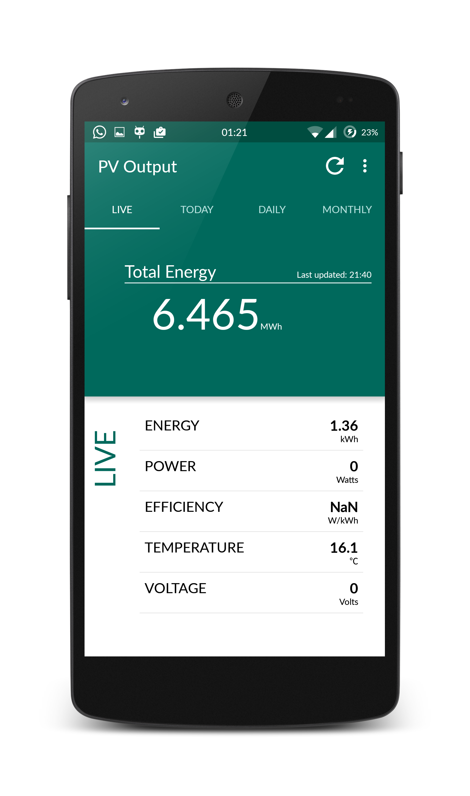

PV Output for Android
===================================

PV Output for Android is a clean and easy app for getting a quick status overview of ones PV system.

Introduction
------------

For iOS a clean and easy app was already available. When I switched to a smarthone running Android I really missed a simple app to monitor the output of my PV system.

Pre-requisites
--------------

- Android SDK v23
- Android Build Tools v23.0.0
- Android Support Repository

Screenshots
-------------

Getting Started
---------------

This sample uses the Gradle build system. To build this project, use the
"gradlew build" command or use "Import Project" in Android Studio.

Current Status
---------------

The app can currently show the pvoutput energy generation data in a Live/Today, Daily and Monthly view for a single pvoutput.org system. Additional functionality can be added as long as it's meaningful to the majority of the targeted users and as long as it doesn't compromise on cleanliness and ease of use.
The code is not optimized and may not be compliant to standard naming conventions yet. 

License
-------

Copyright 2015 The PV Ouput for Android Project

Licensed to the Apache Software Foundation (ASF) under one or more contributor
license agreements.  See the NOTICE file distributed with this work for
additional information regarding copyright ownership.  The ASF licenses this
file to you under the Apache License, Version 2.0 (the "License"); you may not
use this file except in compliance with the License.  You may obtain a copy of
the License at

http://www.apache.org/licenses/LICENSE-2.0

Unless required by applicable law or agreed to in writing, software
distributed under the License is distributed on an "AS IS" BASIS, WITHOUT
WARRANTIES OR CONDITIONS OF ANY KIND, either express or implied.  See the
License for the specific language governing permissions and limitations under
the License.
